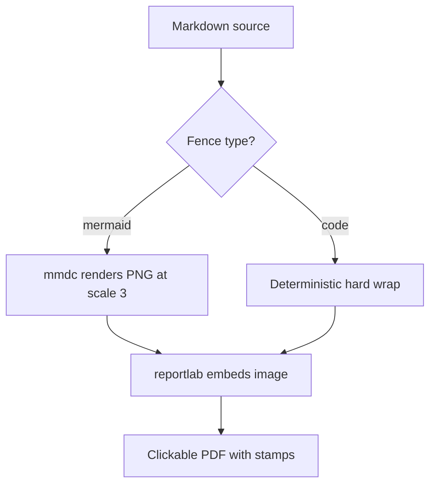
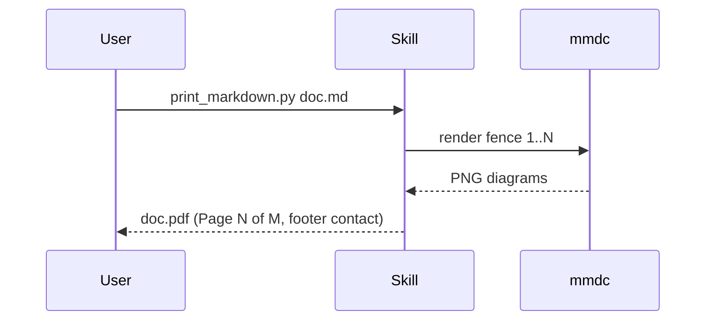

# Sample document: every construct this renderer supports

**Date:** 2026-08-02. This file doubles as the install smoke test: render it and compare against the checklist at the bottom.

## Links, emphasis, and inline code

A [timestamped video deep-link](https://www.youtube.com/watch?v=57lDpTwiW6g&t=127) must stay clickable, as must a bare URL like https://example.com/path?a=1&b=2. **Bold**, *italic*, and `inline_code()` should all render inside one paragraph.

> A blockquote renders indented and gray, like a quoted question in a work note.

## Lists

1. First ordered item
2. Second ordered item
   - Nested unordered child
   - Another child with a [link](https://example.com)
3. Third ordered item

- Plain bullet
- Bullet with **bold** and `code`

## Table with links in cells

| Source | Link | Notes |
|---|---|---|
| A creator video with a fairly long title that wraps | [watch at 2:07](https://www.youtube.com/watch?v=MM320sAhFoY&t=127) | Links inside table cells must remain clickable |
| Short row | https://example.com | Bare URL in a cell |

## Code block

```python
def wrap_code_lines(text: str, columns: int = 100) -> str:
    """A long line follows to prove deterministic wrapping never overflows the frame edge at print size."""
    return "x" * 200  # this comment plus the string above pushes well past one hundred columns to force a wrap
```

## Mermaid: flowchart



## Mermaid: sequence



---

Checklist: header shows "Page N of M" top-left and the date top-right; footer shows the contact line; both diagrams render; the table has a grid and a shaded header row; every link above is clickable.
